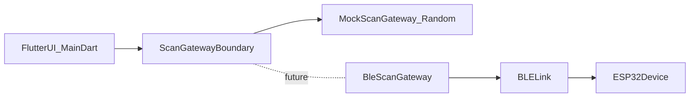
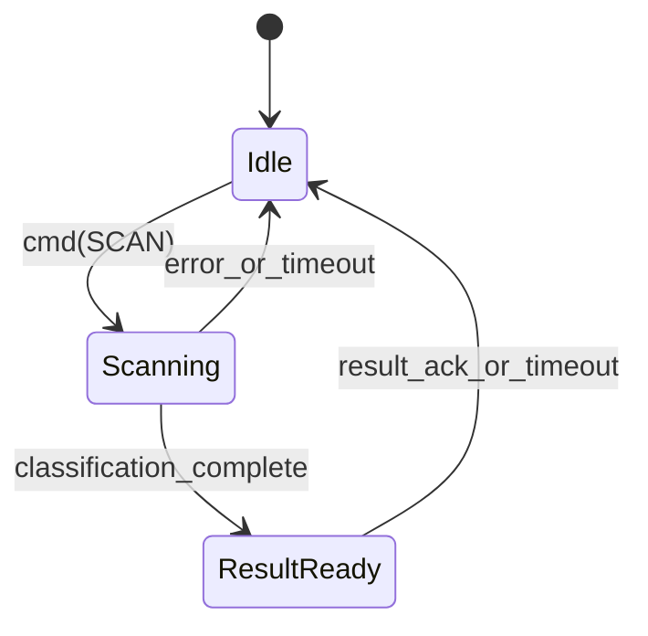

# Architecture

## Purpose
This repository contains:
- **Legacy prototype firmware** (Arduino MKR WiFi 1010) that hosts a web UI and returns a simple `SAFE/UNSAFE` result.
- A **new Flutter mobile app** (in progress).
- Work-in-progress ESP32 experiments (do not modify without approval).

The next prototype will shift from **WiFi + hosted web server** to **Bluetooth Low Energy (BLE)** so a phone can connect directly to the device.

## Frontend-first migration strategy
The app migration is intentionally staged so UI work can proceed before BLE firmware is complete.

### Stage 1 (now): Flutter parity with Arduino web UX
- Implement the current user flow directly in Flutter:
  - allergen checklist
  - scan button with loading state
  - safe/unsafe result modal
- Keep implementation in `main.dart` while scope is small.

### Stage 2 (bridge): service boundary in app
- UI calls a scan boundary (`ScanGateway`) rather than firmware/BLE code directly.
- Initial implementation is a mock simulator (`MockScanGateway`) for frontend velocity.
- Future implementation is `BleScanGateway` with the same interface.

### Stage 3 (future): BLE integration
- Replace mock gateway with BLE gateway, preserving UI/state structure.
- Add device connection lifecycle UI and BLE error handling without rewriting core scan UI.



## Target architecture (BLE prototype)
### Components
- **ESP32-S3 firmware (Seeed XIAO ESP32-S3)**
  - Acts as a **BLE GATT server**
  - Reads the optical sensor (ADC)
  - Classifies readings using a threshold / calibration model
  - Provides non-blocking UI feedback (LEDs/buzzer if present)
  - Persists configuration + short scan history in **NVS**
- **Flutter mobile app (Android + iOS)**
  - Acts as a **BLE client**
  - Scans, connects, and manages reconnections
  - Sends commands (start scan, calibrate)
  - Displays results and history
  - Stores scan history locally (optional) for UX and backup

### Data flow
```mermaid
flowchart LR
  phone[FlutterPhoneApp] -->|scan_connect| ble[BLE]
  phone -->|write_cmd(SCAN)| ble
  ble --> esp32[ESP32S3_Firmware]
  esp32 -->|notify_status_result| ble
  esp32 --> sensor[OpticalSensor_ADC]
  esp32 --> nvs[NVS_Config_History]
  phone -->|read_history| ble
```

## Device (ESP32-S3) architecture
### Firmware modules (what will need to be built)
- **BleStack**
  - Advertising + connection lifecycle
  - GATT services/characteristics (defined below)
  - MTU negotiation and chunking for larger payloads (history)
- **Sensor**
  - ADC read, averaging/filtering (e.g. moving average)
  - Optional “raw stream” mode for calibration/debug
- **Classifier**
  - Threshold-based classification for prototype
  - Future: multi-feature model if sensor pipeline expands
- **StateMachine**
  - `IDLE -> SCANNING -> RESULT -> IDLE`
  - Enforces one scan at a time and consistent status reporting
- **Storage (NVS)**
  - Persists calibration/threshold parameters
  - Stores scan history as a bounded ring buffer
- **Indicators**
  - LED patterns that do not block BLE responsiveness

### State machine


## BLE GATT profile (proposed)
### Custom service: `ChompSafeService`
Use a single custom service UUID (project-owned) with multiple characteristics.

#### Characteristics
- **DeviceInfo** (Read)
  - Firmware version, hardware revision, device id
- **Command** (Write or WriteWithoutResponse)
  - Commands: `SCAN`, `CALIBRATE_START`, `CALIBRATE_END`, `CLEAR_HISTORY`
- **Status** (Notify + Read)
  - Device state: `IDLE`, `SCANNING`, `RESULT_READY`, `ERROR`
  - Error codes (if any)
- **Result** (Notify + Read)
  - Scan result payload (see below)
- **SensorRaw** (Read, optional Notify)
  - Raw ADC value(s) for calibration/debug
- **Config** (Read/Write)
  - Threshold + calibration parameters
- **History** (Read/Notify, chunked)
  - Recent results as a bounded list (paged/chunked)

### Payload formats
For the prototype, prefer a compact, easy-to-debug format:
- **Result**: small JSON (or compact binary) containing:
  - timestamp, rawReading, threshold, classification, fwVersion
- **History**: list of recent results; support chunking for BLE MTU limits.

## Flutter app architecture
### App layers (recommended)
- **BLE data layer**
  - scanning, connect/disconnect, characteristic read/write/notify
  - permission handling per platform
- **Domain layer**
  - `ScanRequest`, `ScanResult`, `DeviceInfo`, `DeviceConfig`
- **UI**
  - Connection screen (scan + select device)
  - Main scan screen (start scan, show status/result)
  - Settings screen (threshold + calibration)
  - History screen (device history + optional local history)

### Platform considerations (Android + iOS)
- Android requires runtime permissions and Bluetooth enablement UX.
- iOS requires correct BLE usage descriptions and handles permissions differently.
